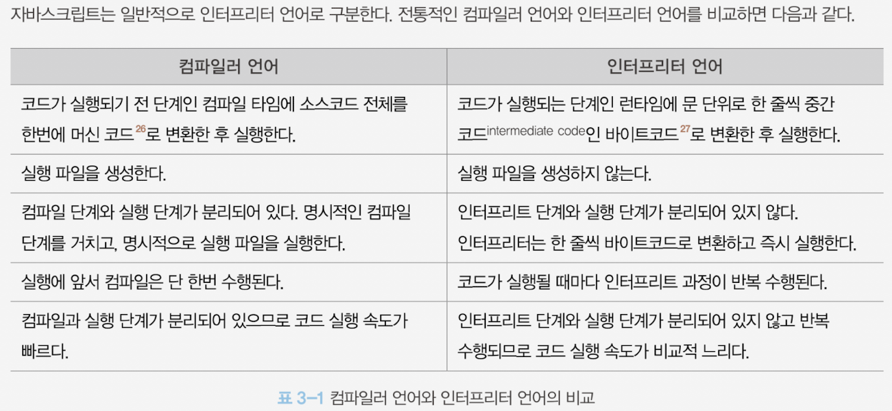

# 02. JavaScript

## 프로그래밍

#### 01. 프로그래밍이란 뭐라고 생각하나요?

    프로그래밍이란 0과 1밖에 알지 못하는 기계가 실행할 수 있을 정도로 정확하고 상세하게 요구사항을 설명하는 작업이며, 그 결과물이 바로 코드다.

#### 02. 컴파일러는 뭐고 인터프리터는 뭔가요?

    하지만 대부분의 모던 브라우저에서 사용되는 인터프리터 는 전통적인 컴파일러 언어처럼 명시적인 컴파일 단계를 거치지는 않지만 복잡한 과정을 거치며 일부 소스코드를 컴파일하고 실행한다.

    이를 통해 인터프리터 언어의 장점인 동적 기능 지원을 살리면서 실행 속도가 느리다는 단점을 극복한다. 따라서 현재는 컴파일러와 인터프리터의 기술적 구분이 점차 모호해져가는 추세다. 하지만 자바스크립트는 런타임에 컴파일되며 실행 파일이 생성되지 않고 인터프리터의 도움없이 실행할 수 없기 때문에 컴파일러 언어라고 할 수 는 없다

## 자바스크립트란

#### 01. 자바스크립트의 특징은 뭐가 있나요?

    자바스크립트는 HTML, CSS와 함께 웹을 구성하는 요소 중 하나로 웹 브라우저에서 동작하는 유일한 프로그래밍 언어다. 또한, 자바스크립트는 개발자가 별도의 컴파일 작업을 수행하지 않는 인터프리터 언어이며 명령형, 함수형, 프로토타입기반, 객체지향 프로그래밍을 지원하는 멀티 패러다임 프로그래밍 언어다.

## 변수

#### 01. 변수란 무엇인가요?
